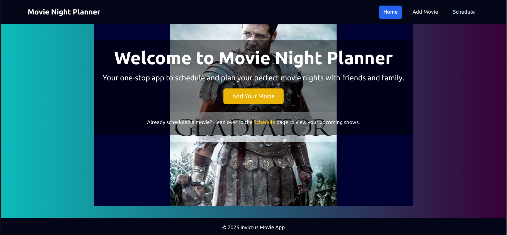

# Movie Night Planner

**Project Description**:  
A simple yet unique app that helps you plan and schedule your movie night. With the Movie Night Planner, users can add their favorite movies, schedule them, and have a seamless experience for planning a fun and organized movie night.

---

### 🛠 Technologies Used:
- **React** - JavaScript framework used for building the user interface.
- **TailwindCSS** - A utility-first CSS framework for styling.
- **React Router DOM** - For client-side routing.
- **React Hot Toast** - For notification popups.
- **json-server** - For backend simulation and handling movie data.

---

### 📸 Screenshot

### 🚀 Live Demo:
Check out the live version of the app on Vercel:  
[Movie Night Planner on Vercel](https://movie-night-planner-eosin.vercel.app/)

---

### 🧑‍🤝‍🧑 Collaborators:
- **Team Lead**: Christine Mworia
- **Collaborators**:
  - Anderson Waithaka
  - Boniface Muguro
  - Carlos Kiplangat
  - Regina Kariuki
  - Michael Munga

---

### 📍 Features:
- **Add Movies**: Add your favorite movies to the system.
- **Schedule Movies**: Pick a time and schedule the movie for your movie night.
- **User-Friendly Interface**: Simple and responsive design for easy use across devices.
- **Notification Alerts**: Stay notified when your movie is scheduled.

---

©️ 2025 Invictus Group 2 Movie App

